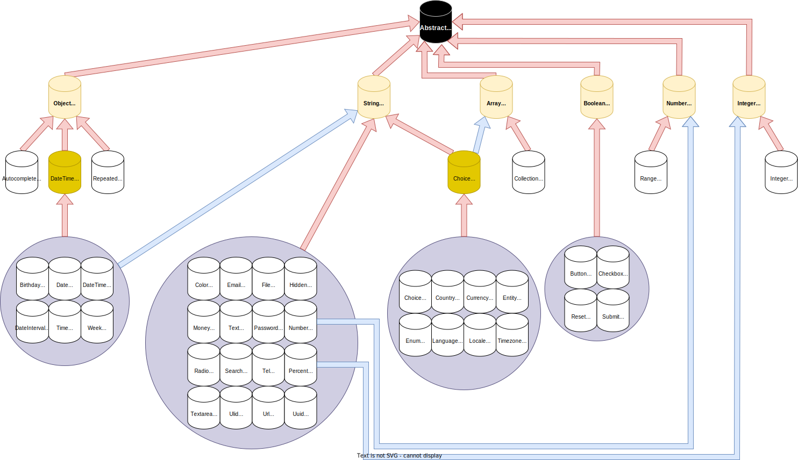

# JsonSchemaBundle

A bundle to serialize a [Symfony Form](https://github.com/symfony/form) into a [JSON Schema](https://json-schema.org/) (RFC `2020-12`).

## Installation

`$ composer require w3r-one/json-schema`

If you're not using [Symfony Flex](https://github.com/symfony/flex), you've to register the bundle manually:

```php
// config/bundles.php

return [
    // ...
    W3rOne\JsonSchemaBundle\W3rOneJsonSchemaBundle::class => ['all' => true],
];
```

## Usage

```php
namespace App\Controller;

use App\Entity\Partner;
use App\Form\PartnerType;
use W3rOne\JsonSchemaBundle\JsonSchema;
use Symfony\Component\HttpFoundation\Response;
use Symfony\Component\HttpFoundation\JsonResponse;

class FormController extends AbstractController
{
    public function partnerAdd(JsonSchema $jsonSchema): Response
    {
        $form = $this->createForm(PartnerType::class, new Partner(), ['validation_groups' => ['Default', 'Form-Partner']]);

        return new JsonResponse($jsonSchema($form));
    }
```

<details><summary>View the generated JSON Schema</summary>

```js
{
	"$schema": "https://json-schema.org/draft/2020-12/schema",
	"$id": "http://localhost/schemas/partner.json",
	"type": "object",
	"title": "partner",
	"properties": {
		"_token": {
			"type": "string",
			"title": "",
			"writeOnly": true,
			"default": "1996112795cc2bfa7d399fb.1rqGabut308UPJvtLSqXwgrrIXMqdei_M0T3DH53B50.tdzwLf-Atgdddf-qZF3dl127SABsENrMfiCdOAwRXvqBz_4Dz5SMfWMF6A",
			"options": {
				"widget": "hidden",
				"layout": "default"
			}
		},
		"name": {
			"type": "string",
			"title": "Nom",
			"options": {
				"widget": "text",
				"layout": "default",
			}
		},
		"types": {
			"type": "array",
			"title": "Types",
			"options": {
				"widget": "choice",
				"layout": "default",
				"attr": {
					"readonly": true
				},
				"choice": {
					"expanded": true,
					"multiple": true,
					"filterable": true,
					"enumTitles": ["Client", "Fabricant", "Sous-traitant", "Installateur", "Fournisseur", "Concurrent", "Gestionnaire"]
				}
			},
			"items": {
				"type": "string",
				"enum": ["customer", "manufacturer", "subcontractor", "installer", "supplier", "rival", "administrator"]
			},
			"minItems": 1,
			"uniqueItems": true
		},
		"address": {
			"type": "object",
			"title": "Adresse",
			"options": {
				"widget": "address",
				"layout": "default"
			},
			"properties": {
				"raw": {
					"type": "string",
					"title": "",
					"writeOnly": true,
					"options": {
						"widget": "text",
						"layout": "default",
						"attr": {
							"maxlength": 255,
							"placeholder": "Tapez une adresse"
						}
					}
				},
				"formatted": {
					"type": "string",
					"title": "",
					"options": {
						"widget": "hidden",
						"layout": "default"
					}
				},
				"coords": {
					"type": "object",
					"title": "",
					"options": {
						"widget": "coords",
						"layout": "default"
					},
					"properties": {
						"lat": {
							"type": "string",
							"title": "",
							"options": {
								"widget": "hidden",
								"layout": "default"
							}
						},
						"lng": {
							"type": "string",
							"title": "",
							"options": {
								"widget": "hidden",
								"layout": "default"
							}
						}
					}
				},
				"nb": {
					"type": "string",
					"title": "",
					"options": {
						"widget": "hidden",
						"layout": "default"
					}
				},
				"street": {
					"type": "string",
					"title": "",
					"options": {
						"widget": "hidden",
						"layout": "default"
					}
				},
				"zipcode": {
					"type": "string",
					"title": "",
					"options": {
						"widget": "hidden",
						"layout": "default"
					}
				},
				"state": {
					"type": "string",
					"title": "",
					"options": {
						"widget": "hidden",
						"layout": "default"
					}
				},
				"city": {
					"type": "string",
					"title": "",
					"options": {
						"widget": "hidden",
						"layout": "default"
					}
				},
				"country": {
					"type": "string",
					"title": "",
					"options": {
						"widget": "hidden",
						"layout": "default"
					}
				}
			}
		},
		"url": {
			"type": "string",
			"title": "Site web",
			"options": {
				"widget": "url",
				"layout": "default"
			}
		},
		"email": {
			"type": "string",
			"title": "Adresse email",
			"options": {
				"widget": "email",
				"layout": "default"
			}
		},
	},
	"required": [],
	"options": {
		"widget": "partner",
		"layout": "default",
		"form": {
			"method": "POST",
			"action": "http://localhost/partner/json_schema",
			"async": true
		}
	}
}
```

</details>

## Purpose

The goal behind this bundle is based on the fact that it is complicated for a modern front-end application to maintain a form component that is not mapped directly on a Symfony FormType.

Most of the time, the front-end component is defining form's props in a static way and if the back-end wants to update the form, we need to work twice, it's error prone and it's not extensive at all.

The main idea is to give the lead to the back-end, provide a JSON schema dynamically that will detail the full component and its related documentation ; the front-end "just" have to display and handle the form on his side.

If the Form is changing or even if it's dynamic based on some roles / scopes / etc., the front-end developer have nothing to change.

It's also allow working with forms directly in Twig and in the same time in a Javascript context.

The business rules are not duplicated and are only handled by the back-end.

This bundle doesn't provide any Front-End component, feel free to choose the stack that feet your needs to build your own Javascript Form.

### Logic

* Back-End
  * Create your FormType as usual (it can include dynamic fiels, ACL, business rules, FormEvents, etc.)
  * Extend it if needed (through `w3r_one_json_schema` or your own Transformers)
  * Optional: sending it to the view and display/test it directly in Twig
  * Serialize the Form into a JSON Schema and send it to the view
  * Optional: serialize the initial data as well to hydrate your form data
* Front-End
  * Create the main form (`options.form.method` + `options.form.action`)
  * Iterate recursively on all sub properties to create the complete form.
  * Map each child with the correct JS component thanks to `options.widget` (+ `options.layout` if needed)
  * Optional: hydrate each field value with initial data
  * Handle submit on XHR (custom HTTP header `X-Requested-With: XMLHttpRequest` thanks to `options.form.async`) or normally
  * Display errors if any - else a flash message / redirect the user

### Concrete exemple

This example allow to handle a form directly in Twig without XHR AND with async Javascript, feel free to drop completely the twig/not async part.

```php
<?php

namespace App\Controller;

use App\Entity\Partner;
use App\Form\PartnerType;
use Sensio\Bundle\FrameworkExtraBundle\Configuration\Entity;
use Symfony\Component\HttpFoundation\JsonResponse;
use Symfony\Component\HttpFoundation\Request;
use Symfony\Component\HttpFoundation\Response;
use W3rOne\JsonSchemaBundle\JsonSchema;
use W3rOne\JsonSchemaBundle\Utils;

class PartnerController extends AppAbstractController
{
    /**
     * @Entity("partner", expr="repository.findOne(partnerId)")
     */
    public function edit(Partner $partner, JsonSchema $jsonSchema, Request $request): Response
    {
        $form = $this->createForm(PartnerType::class, $partner, ['validation_groups' => ['Default', 'Form-Partner'], 'scope' => 'edit'])->handleRequest($request);

        if ($form->isSubmitted()) {
            if ($form->isValid()) {
                $this->em->flush();

                if ($request->isXmlHttpRequest()) {
                    return new JsonResponse([
                        'message' => 'The partner was successfully updated.',
                        'redirect_url' => $this->generateUrl('app_partner_show', ['partnerId' => $partner->getId()]),
                    ], Response::HTTP_OK);
                } else {
                    $this->addFlash('success', 'The partner was successfully updated.');

                    return $this->redirectToRoute('app_partner_show', ['partnerId' => $partner->getId()]);
                }
            } else {
                if ($request->isXmlHttpRequest()) {
                    return new JsonResponse([
                        'message' => 'There are errors in the form, please check.',
                        'errors' => Utils::getErrors($form),
                    ], Response::HTTP_BAD_REQUEST);
                } else {
                    $this->addFlash('error', 'There are errors in the form, please check.');
                }
            }
        }

        return $this->render('pages/partner/edit.html.twig', [
            'form' => $form->createView(),
            'partner' => $partner,
            'pageProps' => \json_encode([
                'form' => $jsonSchema($form),
                'errors' => Utils::getErrors($form),
                'partner' => \json_decode($this->apiSerializer->serialize($partner, ['default', 'partner'])),
            ]),
        ]);
    }
}
```

`$this->em` is a simple reference to the `EntityManagerInterface`.

`$this->apiSerializer` is a simple service based on the Symfony Serializer.

<details><summary>View the service</summary>

```php
<?php

namespace App\Serializer;

use Symfony\Component\Serializer\Normalizer\AbstractNormalizer;
use Symfony\Component\Serializer\Normalizer\AbstractObjectNormalizer;
use Symfony\Component\Serializer\SerializerInterface;

class ApiSerializer
{
    private $serializer;

    public function __construct(SerializerInterface $serializer)
    {
        $this->serializer = $serializer;
    }

    public function serialize($data, array $groups = ['default'], array $attributes = [], array $callbacks = []): string
    {
        $context = [
            AbstractObjectNormalizer::ENABLE_MAX_DEPTH => true,
            AbstractNormalizer::GROUPS => $groups,
        ];
        if (!empty($attributes)) {
            $context[AbstractNormalizer::ATTRIBUTES] = $attributes;
        }
        if (!empty($callbacks)) {
            $context[AbstractNormalizer::CALLBACKS] = $callbacks;
        }

        return $this->serializer->serialize($data, 'json', $context);
    }
}

```

</details>

## Architecture

The [resolver](src/Resolver.php) will traverse the form, guess the right Transformer for each property and apply recursive transformations based on the following schema.



**Legend**
* Transformers
  * Black: Base transformer
  * Yellow: Json Schema native transformers
  * Orange: Intermediate transformers
  * White: Symfony Form Type' transformers
* Relations:
  * Red: direct inheritance
  * Blue: indirect inheritance depending on a specific FormType's option, e.g.
    * `widget` for the Date types
    * `multiple` for the Choice type
    * `input` for `NumberType`
    * `fractional` for `PercentType`

You can add your own transformers, or override/extend the transformers of your choice by yourself, see the dedicated section of this readme.

If needed, the [form extension](src/Form/Extension/JsonSchemaExtension.php) allow you to add custom props in `w3r_one_json_schema` to pass to your json specs.

### Translator

This bundle relies on Symfony `TranslatorInterface` to translate:
* `label` (with `label_translation_parameters`)
* `help` (with `help_translation_parameters`)
* named enums (from `ChoiceType`)
* `attr.title` (with `attr_translation_parameters`)
* `attr.placeholder` (with `attr_translation_parameters`)
* error messages

The translation domain is dynamically retrieved from `translation_domain` option:
* disabled if `false === translation_domain`
* property scope if `null !== translation_domain`
* parent scope if any `translation_domain` is found recursively

### CSRF

If you've installed [`symfony/security-csrf`](https://github.com/symfony/security-csrf) and enabled [`crsf_protection`](https://symfony.com/doc/current/security/csrf.html) on you FormType, the bundle will automatically add the correct csrf property (`_token` by default) with the default generated value (thanks to the `TokenGeneratorInterface`) in a `hidden` widget.

## Built-in FormType

All Symfony [FormTypes](https://symfony.com/doc/current/reference/forms/types.html) as 6.2 version are supported.

<details><summary>View the complete list</summary>

* TextType
* TextareaType
* EmailType
* PasswordType
* SearchType
* UrlType
* TelType
* ColorType
* FileType
* RadioType
* UuidType
* UlidType
* HiddenType
* IntegerType
* MoneyType
* NumberType
* PercentType
* RangeType
* ChoiceType
* EnumType
* EntityType
* CountryType
* LanguageType
* LocaleType
* TimezoneType
* CurrencyType
* DateType
* DateTimeType
* TimeType
* WeekType
* BirthdayType
* DateIntervalType
* CollectionType
* CheckboxType
* ButtonType
* ResetType
* SubmitType
* RepeatedType

</details>

## Supported JSON Schema specs

* [$schema](https://json-schema.org/understanding-json-schema/reference/schema.html#schema) (`https://json-schema.org/draft/2020-12/schema`)
* [$id](https://json-schema.org/understanding-json-schema/structuring.html#id) (`{host}/schemas/{formType}.json`)
* [type](https://json-schema.org/understanding-json-schema/reference/type.html) (`object`|`array`|`string`|`number`|`integer`|`bool`)
* [title](https://json-schema.org/understanding-json-schema/reference/generic.html#annotations) (FormType name at parent level, `label` FormType's option at child level or empty string if the `label` is set to `false`)
* [description](https://json-schema.org/understanding-json-schema/reference/generic.html#annotations) (FormType `help_message` FormType's option)
* [properties](https://json-schema.org/understanding-json-schema/reference/object.html#properties) (children properties)
* [enum](https://json-schema.org/understanding-json-schema/reference/generic.html#enumerated-values) (constant values)
* [readOnly](https://json-schema.org/understanding-json-schema/reference/generic.html#annotations) (if `disabled` FormType's option is set to `true`)
* [writeOnly](https://json-schema.org/understanding-json-schema/reference/generic.html#annotations) (if `mapped` FormType's option is set to `false`)
* [default](https://json-schema.org/understanding-json-schema/reference/generic.html#annotations) (if `data` FormType's option is defined)
* [uniqueItems](https://json-schema.org/understanding-json-schema/reference/array.html#uniqueness) (`true` for an array)

## Unsupported JSON Schema specs (*for now*)

* [required](https://json-schema.org/understanding-json-schema/reference/object.html#required-properties) (need to be guessed from `Doctrine` type + potential `Validator` asserts)
* [minItems|maxItems](https://json-schema.org/understanding-json-schema/reference/array.html#length) (need to be guessed from assert `Count`)
* [exclusiveMinimum|minimum|exclusiveMaximum|maximum](http://json-schema.org/understanding-json-schema/reference/numeric.html#range) (need to be guessed from assert `GreaterThanOrEqual`, `GreaterThan`, `LowerThanOrEqual` & `LowerThan`)
* [minLength|maxLength](https://json-schema.org/understanding-json-schema/reference/string.html#length) (need to be guessed from `Doctrine` type + assert `Length`)
* [pattern](http://json-schema.org/understanding-json-schema/reference/string.html#pattern) (need to be guessed from assert `Regex`)
* [schema composition](https://json-schema.org/understanding-json-schema/reference/combining.html)
* format (?)

## Additional JSON Schema specs

All non standards properties are wrapped into `options` property.

It includes:
* `widget` property to identify the widget behind the component
  * it's the FormType name in snake_case, basically `CustomCollectionType` will give you the widget `custom_collection`
  * the only exception is related to all date's FormTypes where we suffix the javascript widget by the `widget` FormType's option. It can give you very different components:
    * [`DateType`](https://symfony.com/doc/current/reference/forms/types/date.html#widget)
      * `date_choice`
      * `date_text`
      * `date_single_text`
    * [`DateTimeType`](https://symfony.com/doc/current/reference/forms/types/datetime.html#widget)
        * `date_time_choice`
        * `date_time_text`
        * `date_time_single_text`
    * [`TimeType`](https://symfony.com/doc/current/reference/forms/types/time.html#widget)
        * `time_choice`
        * `time_text`
        * `time_single_text`
    * [`WeekType`](https://symfony.com/doc/current/reference/forms/types/week.html#widget)
        * `week_choice`
        * `week_text`
        * `week_single_text`
    * [`BirthdayType`](https://symfony.com/doc/current/reference/forms/types/birthday.html#widget)
        * `birthday_choice`
        * `birthday_text`
        * `birthday_single_text`
    * [`DateIntervalType`](https://symfony.com/doc/current/reference/forms/types/dateinterval.html#widget)
        * `date_interval_choice`
        * `date_interval_text`
        * `date_interval_integer`
        * `date_interval_single_text`
* `layout` property to apply a specific layout to the component (default `default`, can be overridden by `w3r_one_json_schema.layout`)
* `attr` all the HTML attributes defined in the FormType
* at parent level, a `form` property with:
    * `options.form.method` (string: the method of your form - default `POST`)
    * `options.form.action` (string: the action behind your form - default current URI)
    * `options.form.async` (bool: if you want your form in XMLHttpRequest - default true, can be overridden by `w3r_one_json_schema.xmlHttpRequest`)
* all others settings related to a specific FormType:
    * `CheckboxType`
        * `options.checkbox.value`
    * `ChoiceType`
        * `options.choice.expanded`
        * `options.choice.multiple`
        * `options.choice.filterable`
        * `options.choice.placeholder`
        * `options.choice.preferredChoices`
        * `options.choice.enumTitles`
    * `CollectionType`
        * `options.collection.allowAdd`
        * `options.collection.allowDelete`
    * `CountryType`
        * `options.country.alpha3`
    * `DateType/DateTimeType/TimeType/WeekType/BirthdayType/DateIntervalType`
        * `options.date_time.format`
        * `options.date_time.input`
        * `options.date_time.inputFormat`
        * `options.date_time.modelTimezone`
        * `options.date_time.placeholder`
    * `IntegerType`
        * `options.integer.roundingMode`
    * `LanguageType`
        * `options.langugage.alpha3`
    * `MoneyType`
        * `options.money.currency`
        * `options.money.divisor`
        * `options.money.roundingMode`
        * `options.money.scale`
    * `NumberType`
        * `options.number.roundingMode`
        * `options.number.scale`
    * `PasswordType`
        * `options.password.alwaysEmpty`
    * `PercentType`
        * `options.percent.symbol`
        * `options.percent.type`
        * `options.percent.roundingMode`
        * `options.percent.scale`
    * `RadioType`
        * `options.radio.value`
        * `options.radio.falseValues`

If you want to pass other specific properties to your component, feel free to wrap them into `w3r_one_json_schema` property.

For example:

```php
$builder
    ->add('name', TextType::class, [
        'label' => 'Name',
        'w3r_one_json_schema' => [
            'foo' => 'bar',
        ],
    ]);
```

```js
{
    "name": {
        "type": "string",
        "title": "Name",
        "options": {
            "widget": "text",
            "layout": "default",
            "for": "bar"
        }
    },
}
```

## Override / Extend

You can totally override or extend any transformer / json specs of this bundle.

### Widget / Layout resolving

In your FormTypes, you can override any `widget` / `layout` of your choice thanks to the `w3r_one_json_schema` option.

For example:

```php
$builder
    ->add('address', TextType::class, [
        'label' => 'Address',
        'w3r_one_json_schema' => [
            'widget' => 'google_autocomplete',
            'layout' => 'two-cols',
        ],
    ]);
```

```js
{
    "address": {
        "type": "string",
        "title": "address",
        "options": {
            "widget": "google_autocomplete",
            "layout": "two-cols",
        }
    },
}
```

You can also override the default `layout` globally if needed:

```yaml
# config/packages/w3r_one_json_schema.yaml
w3r_one_json_schema:
    default_layout: 'fluid'
```

### FormType Transformers

You can register your namespace(s) that store your own transformers.

```yaml
# config/packages/w3r_one_json_schema.yaml
w3r_one_json_schema:
    transformer_namespaces:
        - 'App\JsonSchema\'
        # - 'App\OtherJsonSchema\'
```

Your transformers are resolved **before ours**, so if you override an existing transformer, it'll be executed in place of the bundle built-in ones.

Transformers **must** implement the [TransformerInterface](src/Transformer/TransformerInterface.php) and must have the pattern {**FormType**}Transformer.php.

For example if you want to override the Symfony `DateIntervalType`, your transformer must be named `DateIntervalTypeTransformer`.

The proper approach is to extend one of ours abstract or specific transformers, redefine method `transform`, call the parent function and extending the json schema before returning it.

You can also implement directly the interface, but you've to manage everything by yourself in this case.

#### Example 1

You're using [VichUploaderBundle](https://github.com/dustin10/VichUploaderBundle) and you want to serialize specific options of this bundle.

Just extend the [AbstractObjectTransformer](src/Transformer/AbstractObjectTransformer.php), call the parent function, embed your json props and voila!

```php
<?php

namespace App\JsonSchema;

use Symfony\Component\Form\FormInterface;
use W3rOne\JsonSchemaBundle\Transformer\AbstractObjectTransformer;
use W3rOne\JsonSchemaBundle\Utils;

class VichFileTypeTransformer extends AbstractObjectTransformer
{
    public function transform(FormInterface $form): array
    {
        $schema = parent::transform($form);
        $schema['options']['vichFile'] = [
            'allowDelete' => $form->getConfig()->getOption('allow_delete'),
            'downloadLink' => $form->getConfig()->getOption('download_link'),
            'downloadUri' => $form->getConfig()->getOption('download_uri'),
            'downloadLabel' => $this->translator->trans($form->getConfig()->getOption('download_label'), [], Utils::getTranslationDomain($form)),
            'deleteLabel' => $this->translator->trans($form->getConfig()->getOption('delete_label'), [], Utils::getTranslationDomain($form)),
        ];

        return $schema;
    }
}
```

#### Example 2

You want to add a `PositionType` as an `integer`.

Here we just extend the correct base `AbstractIntegerTransformer`.

```php
<?php

namespace App\JsonSchema;

use W3rOne\JsonSchemaBundle\Transformer\AbstractIntegerTransformer;

class PositionTypeTransformer extends AbstractIntegerTransformer
{
}
```

#### Example 3

You want to override the `TextareaType` to replace it by a rich-text / wysiwyg editor.

```php
<?php

namespace App\JsonSchema;

use Symfony\Component\Form\FormInterface;
use W3rOne\JsonSchemaBundle\Transformer\Type\TextareaTypeTransformer as BaseTextAreaTypeTransformer;

class TextareaTypeTransformer extends BaseTextAreaTypeTransformer
{
    public function transform(FormInterface $form): array
    {
        $schema = parent::transform($form);
        $schema['options']['widget'] = 'wysiwyg';
        $schema['options']['wysiwyg'] = [
            'config' => [
                // ...
            ],
        ];

        return $schema;
    }
}
```

Note that a better approach would have been to use a `WysiwygType` and to create a specific `WysiwygTypeTransformer`.
